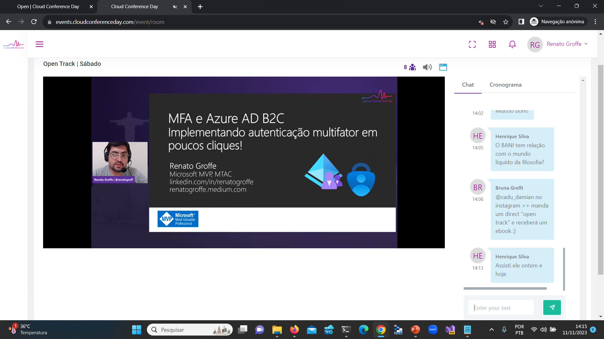
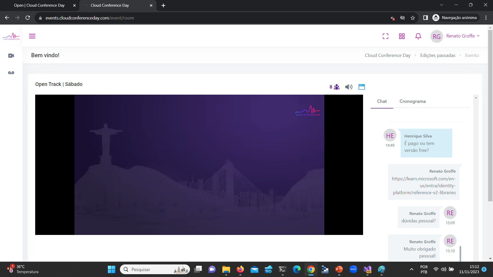
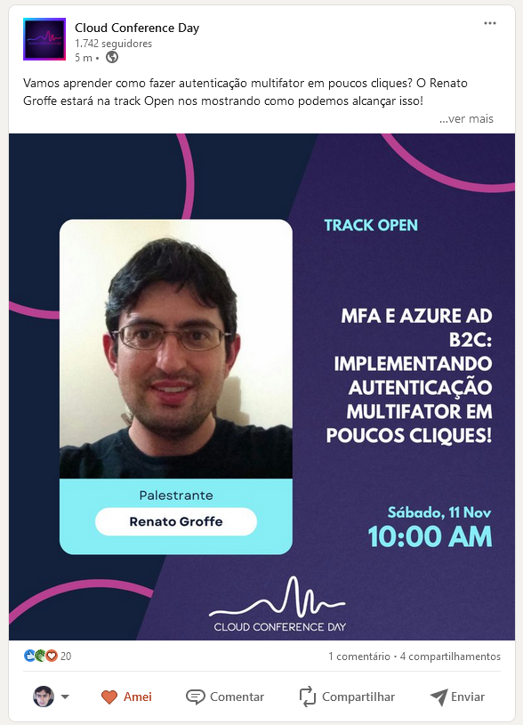

# MFA-ADB2C_CloudConference-2023-11
Exemplo de implementação e utilização de MFA com o Azure AD B2C apresentado durante o Cloud Conference Day.

---

Título da Apresentação: **MFA e Azure AD B2C - Implementando autenticação multifator em poucos cliques!**

Data: **11/11/2023 (sábado)**

Tipo do evento: **Online**

Ferramenta de transmissão: **Streamyard**

Tecnologias utilizadas: **Azure AD B2C, Microsoft Identity, .NET 7, C#, Visual Studio 2022**

Número de participantes: **20 pessoas (estimativa)**

Link do evento: [**LinkedIn**](https://www.linkedin.com/posts/cloud-conference-day_cloud-azure-activity-7124498344151760896-pYXt?utm_source=share&utm_medium=member_desktop)

Site do evento: **https://www.cloudconferenceday.com/**

Deixo aqui meus agradecimentos à **Bruna Grellt** e ao **Rhuan Rocha** por todo o apoio para que eu partipasse como palestrante de mais uma edição do **Cloud Conference**.

---

